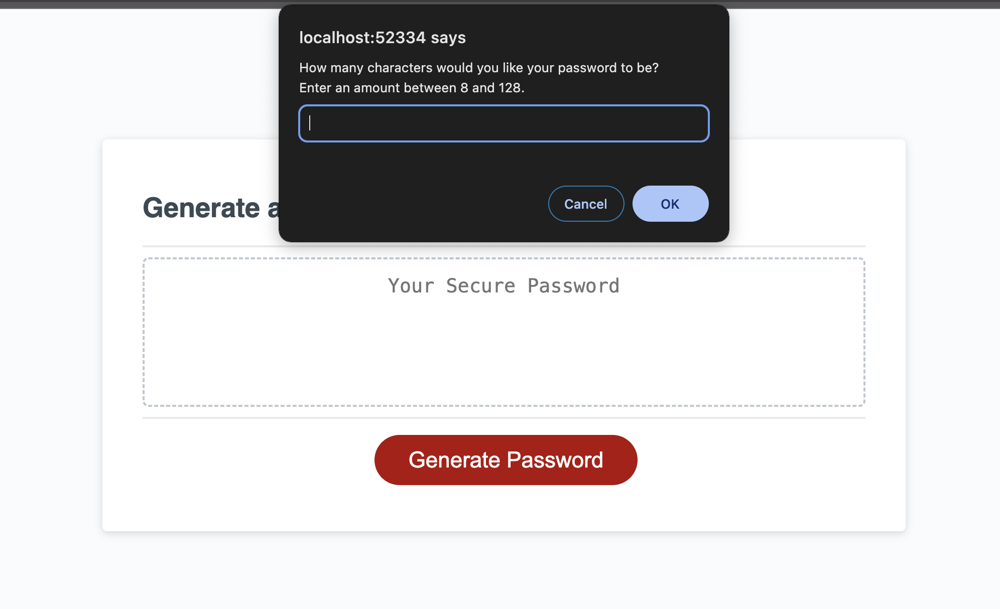

# <password-generator>

## Random Password Generator

-Motivation

This project is a simple JavaScript application that generates random passwords based on user preferences. The user can specify the length of the password, and whether it should contain lowercase letters, uppercase letters, digits, and special characters.

-Why this was built

-What it solved

-What I learned

## Table of Contents

- [Installation] (#installation)
- [Usage] (#usage)
- [Credits] (#credits)

## Installation

Open the index.html file in a web browser.

## Usage

Click the "Generate Password" button.

A prompt will appear asking for the desired password length (between 8 and 128 characters). Enter the desired length and click "OK".

You will be asked whether you want your password to include lowercase letters, uppercase letters, digits, and special characters. 

Choose your preferences by clicking "Yes" or "No" for each category.

After making your selections, a randomly generated password will be displayed in the text box below the "Generate Password" button.

## Credits

I collaborated with Keegan Royal-Eisenberg, Aster Oliva, Meera GK and Aileen Nguyen

Tutorials and resources used

- [Window - Web APIs | MDN](https://developer.mozilla.org/en-US/docs/Web/API/Window)

- [Phind](https://www.phind.com/)

- [javascript password generator - Stack Overflow](https://stackoverflow.com/questions/1497481/javascript-password-generator)

- [Array - JavaScript | MDN](https://developer.mozilla.org/en-US/docs/Web/JavaScript/Reference/Global_Objects/Array)

- [Xpert Learning Assistant](https://bootcampspot.instructure.com/courses/4767/external_tools/313)